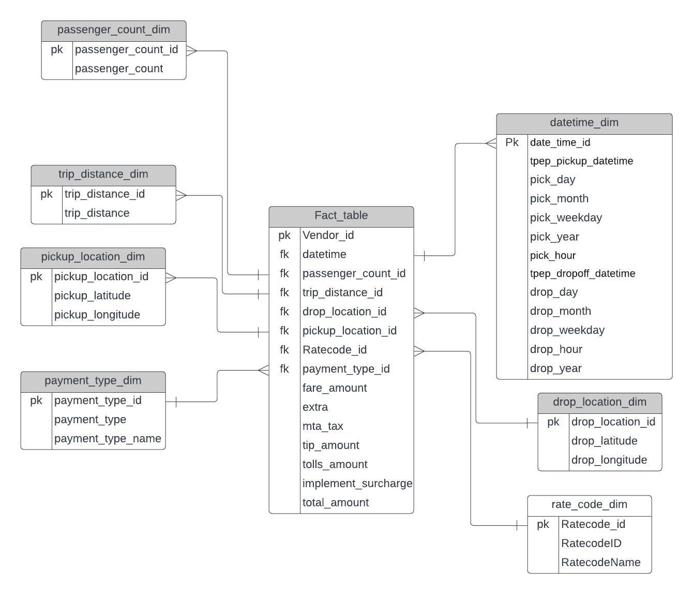

# Uber Data Analytics | Data Engineering using Mage and GCP 

## Introduction

Performed Data Modelling and Data Analytics on the Uber dataset using various tools and technologies, including Google Cloud Storage, python3, Compute Instance, Mage Data Pipeline Tool, BigQuery, and Looker Studio.

## Technologies Used
Programming Language:
    python3 

Cloud Services: 
    1. Google Cloud Storage 
    2. Compute Engine Instance for mage to create an ETL pipeline 
    3. BigQuery 
    4. Looker Studio 

Data Pipeine Tool - https://www.mage.ai/

## Dataset Used
TLC Trip Record Data
Yellow and green taxi trip records include fields capturing pick-up and drop-off dates/times, pick-up and drop-off locations, trip distances, itemized fares, rate types, payment types, and driver-reported passenger counts.

Dataset Link: https://storage.googleapis.com/uber-data-engineering-project-sdsu/uber_data.csv

More information about the dataset:
1. Website - https://www.nyc.gov/site/tlc/about/tlc-trip-record-data.page
2. Data Dictionary - https://www.nyc.gov/assets/tlc/downloads/pdf/data_dictionary_trip_records_yellow.pdf

## Data Model

